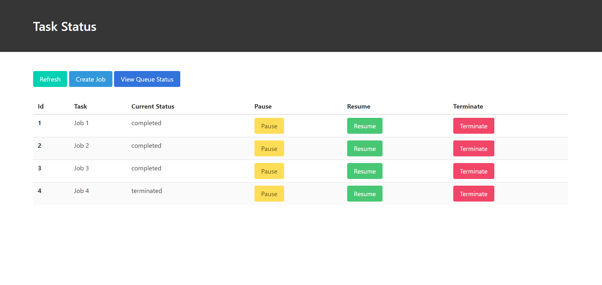
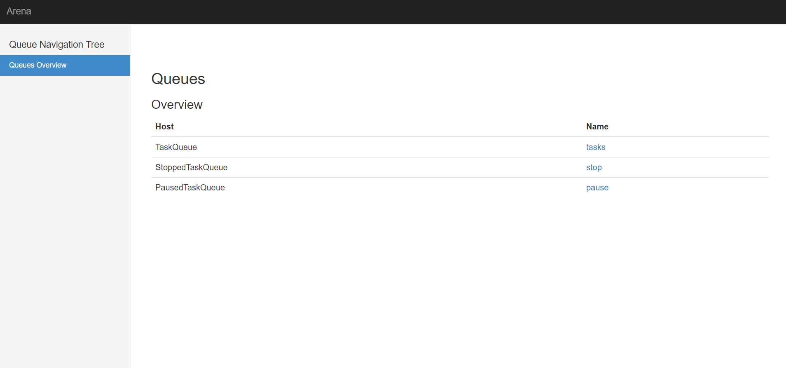

# Backend Task
## Running Docker
```
git clone https://github.com/ishaanverma/backend-task.git
cd backend-task/
docker-compose up
```
Log on to `http://localhost:3000/`

## TODO
- [x] Simulate task processing
- [x] Implement task stopping
- [x] Implement task pausing (pausing currently wastes CPU cycles)
- [x] Implement task resuming
- [x] Add support for actual CSV parsing
- [x] Create DB for task status querying
- [x] Create frontend for displaying task status
- [x] Create docker file

## API Endpoints
Create a Job
```
POST /jobs/create
RESPONSE:
{
  id: <id>
}
```

Pause a Job
```
POST /jobs/pause
{
  id: <id>
}
```

Resume a Job
```
POST /jobs/resume
{
  id: <id>
}
```

Terminate a Job
```
POST /jobs/terminate
{
  id: <id>
}
```

Get status of all Jobs
```
GET /jobs/all
```

## DESCRIPTION
When the user creates a job, the job is added to the `task queue` and a worker will start processing the job. When the user pauses or stops the job, it is added to the `pause queue` or the `stop queue`. The worker periodically checks the both the queues for the job and either terminates the job or pauses the job. 

In its current implementation if the user sends a pause request, the process assigned to the job waits for the resume request, thus wasting processing time. However, this can be changed to save the job's current state to disk and hence free up the process. When a resume request is received, the job's state can be loaded from the disk and added back to the `task queue`. 

## Screenshots


